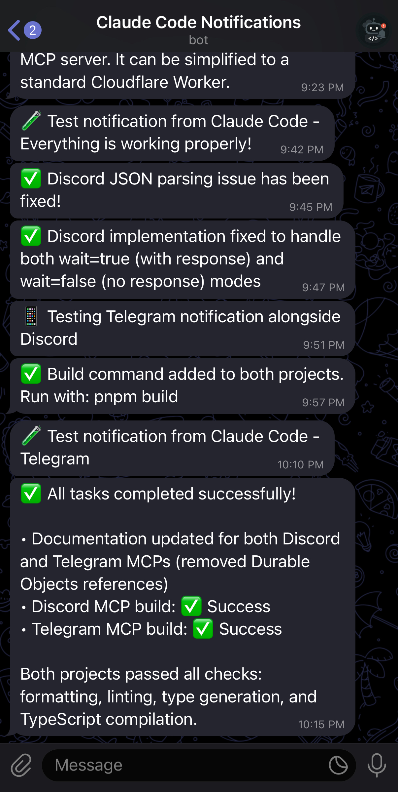
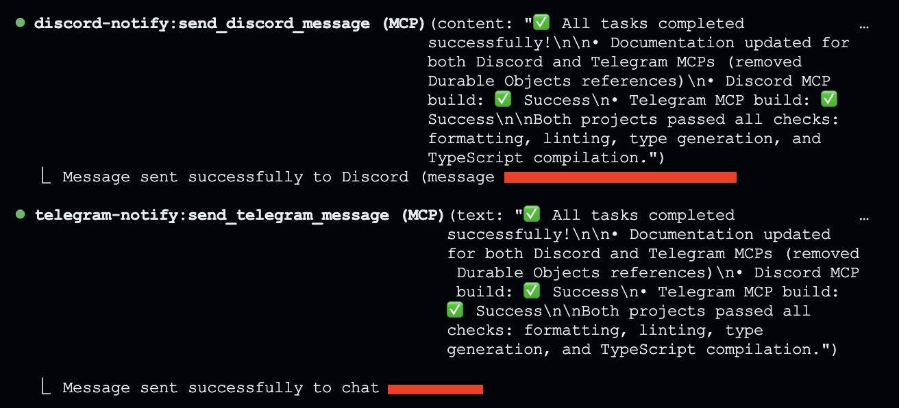

# Telegram Notification MCP Server

<div align="center">
  
  
  An MCP (Model Context Protocol) server that sends notifications to Telegram when Claude Code completes tasks. Built with TypeScript using the Cloudflare Agents SDK and deployable on Cloudflare Workers.
</div>

## Features

- 🤖 **MCP Tool**: Provides a `send_telegram_message` tool for sending notifications
- 🚀 **Cloudflare Workers**: Runs serverless with global distribution
- 🔐 **Secure**: Uses Cloudflare secrets for credentials
- 🌐 **Dual Transport**: Supports both SSE and Streamable HTTP for maximum compatibility
- 💾 **Durable Objects**: State management required by McpAgent
- 💬 **Message Formatting**: Supports Markdown and HTML formatting
- 📝 **Formatting**: Supports Markdown and HTML message formatting

## Architecture

This server implements the MCP specification using Cloudflare's Agents SDK:
- **GET /sse**: SSE endpoint for MCP communication
- **POST /mcp**: Streamable HTTP endpoint for MCP communication
- Built with TypeScript, MCP SDK, and Cloudflare Agents SDK
- Proper JSON-RPC 2.0 error handling
- Durable Objects for stateful connections (required by McpAgent)
- Node.js compatibility mode enabled

## Setup

### Prerequisites

1. **Telegram Bot**: Create a bot via [@BotFather](https://t.me/botfather) and get your bot token
2. **Chat ID**: Get your chat ID by sending a message to your bot and visiting:
   ```
   https://api.telegram.org/bot<YOUR_BOT_TOKEN>/getUpdates
   ```
3. **Cloudflare Account**: Sign up at [cloudflare.com](https://cloudflare.com)

### Installation

1. Clone this repository
2. Install dependencies:
   ```bash
   pnpm install
   ```

### Configuration

1. Create a `.dev.vars` file from the example:
   ```bash
   cp .dev.vars.example .dev.vars
   ```
   Then edit `.dev.vars` with your bot token and chat ID. This file is used for both local development and deployment.

2. For production deployment, set up Cloudflare secrets:
   ```bash
   npx wrangler secret put BOT_TOKEN
   npx wrangler secret put DEFAULT_CHAT_ID  # Optional
   ```
   
   **Note**: The DEFAULT_CHAT_ID is optional. If not set, you must provide a chat_id parameter when calling the `send_telegram_message` tool.

3. Update `wrangler.toml` with your worker name if desired

### Deployment

Deploy to Cloudflare Workers:

Deploy using Wrangler:

```bash
# First set secrets
npx wrangler secret put BOT_TOKEN
npx wrangler secret put DEFAULT_CHAT_ID  # Optional

# Then deploy
pnpm run deploy
```

**Alternative: Continuous Deployment**

You can also set up continuous deployment directly from the cloudflare dashboard. Learn more about [git integration with cloudflare](https://developers.cloudflare.com/pages/configuration/git-integration/)

### Claude Code Configuration

Add the MCP server to Claude Code using the CLI via SSE transport:

```bash
# For production deployment (SSE)
claude mcp add telegram-notify https://your-worker-name.workers.dev/sse -t sse

# For local development
claude mcp add telegram-notify http://localhost:8787/sse -t sse
```

**Note**: This server supports both SSE (Server-Sent Events) and Streamable HTTP transport. While SSE works well, Streamable HTTP provides better reliability and is the newer standard.

You can verify the configuration with:
```bash
claude mcp list
```

## Usage

Once configured, Claude Code can send notifications to your Telegram whenever you need them.

### Available Tool

**send_telegram_message**: Send a notification message to Telegram
- `text` (required): The message text to send
- `chat_id` (optional): Telegram chat ID (uses DEFAULT_CHAT_ID if not provided)
- `parse_mode` (optional): "Markdown" or "HTML" for message formatting
- `disable_notification` (optional): Send message silently

Example usage:
```javascript
// Uses DEFAULT_CHAT_ID from environment
await send_telegram_message({ text: "Task completed!" })

// Send to specific chat (overrides DEFAULT_CHAT_ID)
await send_telegram_message({ text: "Hello!", chat_id: "123456789" })

// Send with Markdown formatting
await send_telegram_message({ 
  text: "*Bold* and _italic_ text", 
  parse_mode: "Markdown" 
})
```

### When You'll Get Notifications

Claude Code sends notifications when:
- You explicitly ask: "notify me when done" or "let me know on Telegram"
- Errors occur during execution
- Important milestones are reached
- User input or intervention is needed

### Example Scenarios

```bash
# You say: "Deploy to production and notify me when done"
# Result: 🤖 Claude Code Notification
#         Deployment completed successfully! The app is now live.

# You say: "Run all tests and let me know the results"
# Result: 🤖 Claude Code Notification
#         All tests passed! 52/52 tests successful.

# You say: "Process this data and notify me if there are any errors"
# Result: 🤖 Claude Code Notification
#         Error: Failed to process row 451 - invalid date format
```

### Example Notifications

<div align="center">
  
  <p><em>Example of Telegram notifications from Claude Code</em></p>
</div>

<div align="center">
  
  <p><em>Claude Code sending notifications during task completion</em></p>
</div>

### CLAUDE.md Examples

To encourage Claude Code to use Telegram notifications effectively, add these to your CLAUDE.md:

```markdown
# Telegram Notifications

Use the mcp__telegram-notify__send_telegram_message tool to send notifications to Telegram.

- Always send a Telegram notification when:
  - A task is fully complete
  - You need user input to continue
  - An error occurs that requires user attention
  - The user explicitly asks for a notification (e.g., "notify me", "send me a message", "let me know")

- Include relevant details in notifications:
  - For builds/tests: success/failure status and counts
  - For errors: the specific error message and file location

- Use concise, informative messages like:
  - "✅ Build completed successfully (2m 34s)"
  - "❌ Tests failed: 3/52 failing in auth.test.ts"
  - "⚠️ Need permission to modify /etc/hosts"
```

## Development

Run locally:
```bash
# Start local development server
pnpm dev
```

For local development, Wrangler will automatically load environment variables from your `.dev.vars` file.

Run all checks before deployment:
```bash
pnpm build
```

This command runs:
1. `pnpm format` - Format code with Biome
2. `pnpm lint:fix` - Fix linting issues  
3. `pnpm cf-typegen` - Generate Cloudflare types
4. `pnpm type-check` - Check TypeScript types

Test the server:
```bash
# Test SSE connection
curl http://localhost:8787/sse

# Test health endpoint
curl http://localhost:8787/
```

## Debugging

### Testing the SSE Connection

You can test the SSE endpoint directly:
```bash
curl -N http://localhost:8787/sse
```

This should return an event stream starting with an `endpoint` event.

### Common Issues

1. **Connection closes immediately**: Check that your worker is running and accessible at the specified URL.

2. **No endpoint event received**: Ensure the SSE headers are being sent correctly and the stream is properly formatted.

3. **Telegram notifications not sent**: Verify your `BOT_TOKEN` and `DEFAULT_CHAT_ID` are correctly set in the worker environment.

## Technical Details

- **Language**: TypeScript (ES2021 target)
- **Runtime**: Cloudflare Workers with Node.js compatibility
- **Protocol**: MCP (Model Context Protocol)
- **Transport**: SSE and Streamable HTTP
- **State Management**: Durable Objects (required by McpAgent)
- **Observability**: Enabled for monitoring

## References

This project was built following these guides:
- [Build a Remote MCP server - Cloudflare Agents](https://developers.cloudflare.com/agents/guides/remote-mcp-server/)
- [Model Context Protocol (MCP) - Cloudflare Agents](https://developers.cloudflare.com/agents/model-context-protocol/)
- [MCP Transport Methods - Cloudflare Agents](https://developers.cloudflare.com/agents/model-context-protocol/transport/)
- [Cloudflare MCP Template (remote-mcp-authless)](https://github.com/cloudflare/ai/tree/main/demos/remote-mcp-authless)

## Related Projects

- [Discord Notification MCP](https://github.com/kstonekuan/discord-notification-mcp) - Send notifications to Discord instead of Telegram

## License

MIT